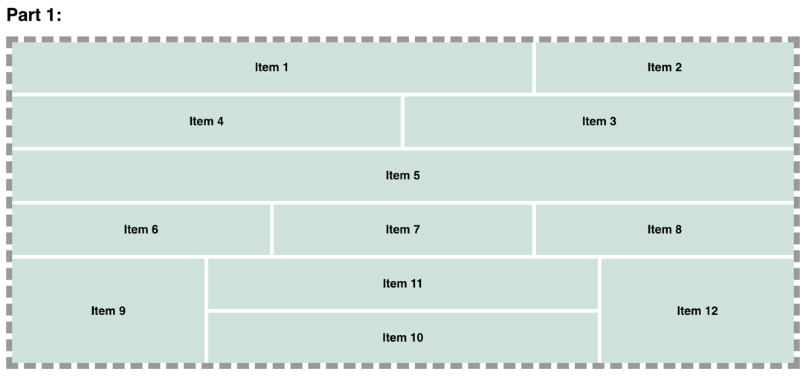
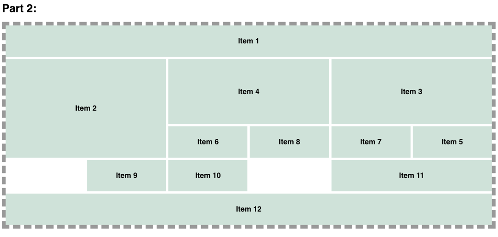
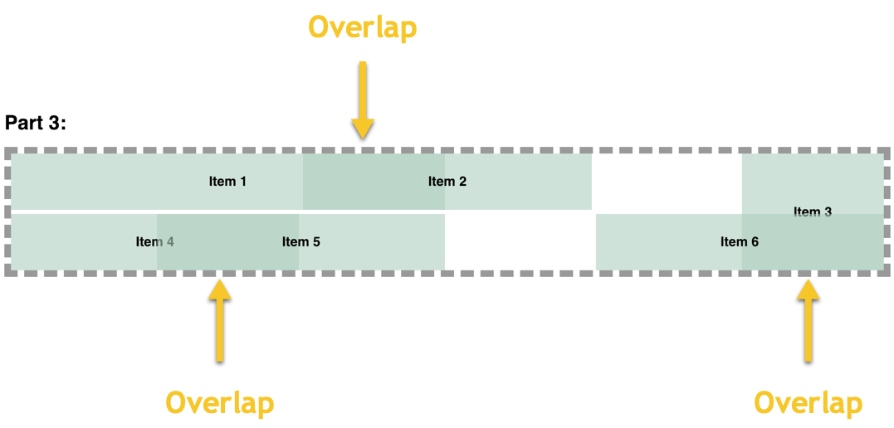
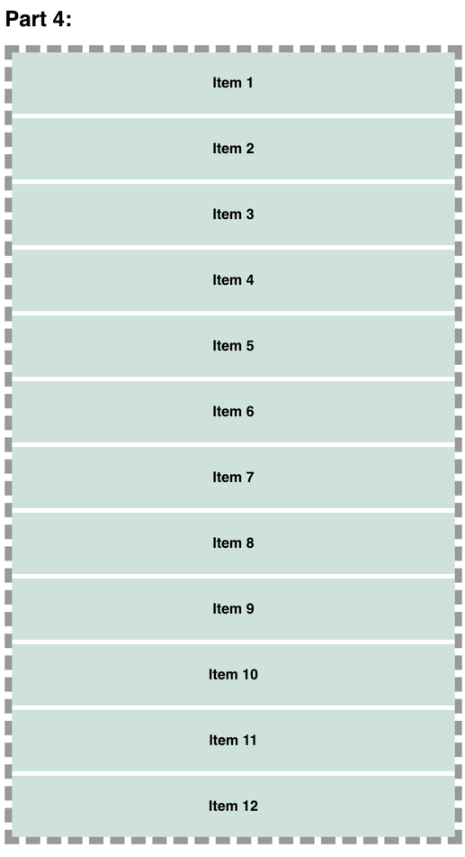
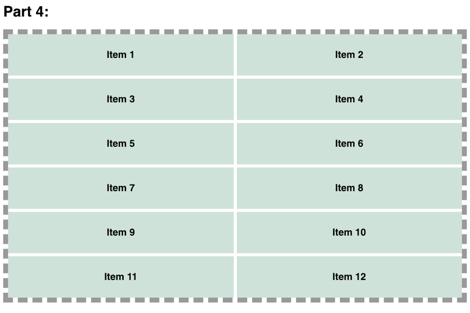
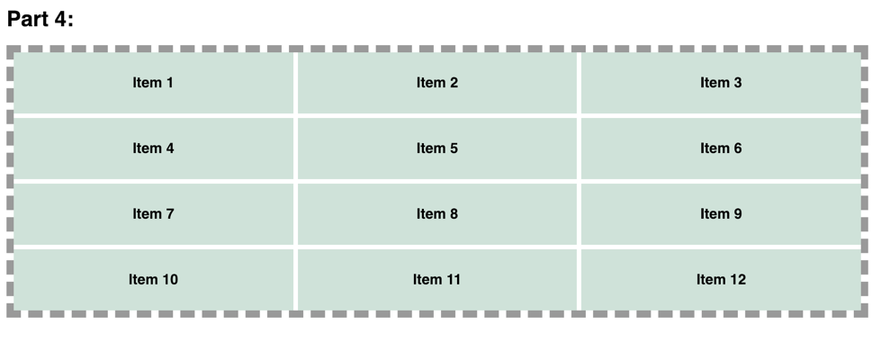
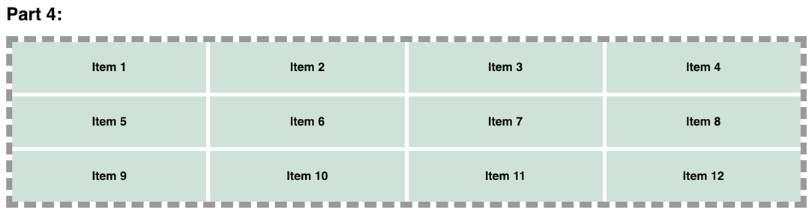
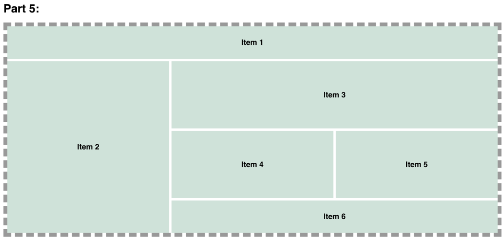

# Stay on the Grid

## Introduction
CSS Grid is a powerful layout system which allows for the control and placement of items into columns and rows

## Objective
For this lab, you recreate the different layouts using the required CSS Grid techniques. 

## Requirements
The following instructions explain the different changes that need to be made to the site. 

1. Download the [Stay on the Grid Starter Files](https://github.com/MTM6230/stay-on-the-grid/archive/master.zip). Add the appropriate CSS to the `style.css` file to make the changes to the web page. **No changes should be made to the `index.html` or `base.css` file.**
2. For  **Part 1**, create a grid 12 columns and 6 rows using the `grid-template-columns` and `grid-template-rows` properties. Then recreate the **Part 1 Layout** using `grid-column` and `grid-row` properties ([see image below](#part-1-layout)). **Do NOT use `grid-template-areas`.**
3. For **Part 2** create a grid 6 columns and 6 rows. Then recreate the **Part 2 Layout** using the `grid-template-areas` and `grid-area` properties ([see image below](#part-2-layout)).
4. For **Part 3**, create a grid 6 columns and 2 rows. Then recreate the **Part 3 Layout** ([see image below](#part-3-layout)).
5. For **Part 4**, create a completely responsive grid where each grid item will be no smaller than 250px ([see images below](#part-4-layout)). **Do NOT use media queries.**
6. For **Part 5**, recreate the **Part 5 Layout** using nested grids ([see image below](#part-5-layout)).

*TIP: Target each part's item by including the appropriate part class (`.part1`, `.part2`, etc) in the CSS selector.*

*Example:* `.part1 .item1 { }`

### Part 1 Layout

### Part 2 Layout

### Part 3 Layout

### Part 4 Layout

### Part 5 Layout

